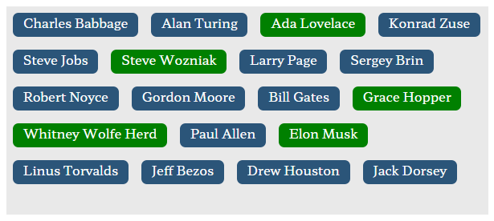

# Form-Input Tag/Label List

## Usage
Download the `style.css` and `TagList.js` files and import them in your HTML like so: 
```html 
<head>
    <!--...-->
    <link rel="stylesheet" href="css/style.css">
</head>
<body>
    <!--...-->
    <script src="js/TagList.js"></script>
</body>

```
In your `<form>` create a div element with a `name` attribute and add `tag-container` to the `class` attribute
```html
<div name="it-giants" class="tag-container">
    <div data-value="Charles Babbage" class="tag">Charles Babbage</div>
    <div data-value="Alan Turing" class="tag">Alan Turing</div>
    <div data-value="Ada Lovelace" class="tag active">Ada Lovelace</div>
    <div data-value="Konrad Zuse" class="tag">Konrad Zuse</div>
    <div data-value="Gordon Moore" class="tag">Gordon Moore</div>
    <div data-value="Grace Hopper" class="tag active">Grace Hopper</div>
    <div data-value="Linus Torvalds" class="tag">Linus Torvalds</div>
    <!--...-->
</div>
```
Now in your own JS or HTML in a `<script>` tag, create an instance of the TagList Class:
```js
taglist_container = new TagList('div[name=it-giants]');
```
Now everything should be good to go and you should see something like this:



Here I clicked on `Elon Musk` and then `Steve Wozniak`. The three elements with the class `active` were automatically added when the instance of the class was created.

## How it works
The JS code automatically adds hidden inputs to a `<span>` element at the top of the container and removes them again if deselected.

## The Result
The form will send an array with the value of the name attribute of the container. In this example: `it-giants`

Here is what you'd get from the above example:
```json
{
  "it-giants": [
    "Ada Lovelace",
    "Grace Hopper",
    "Whitney Wolfe Herd",
    "Elon Musk",
    "Steve Wozniak"
  ]
}
```

[EXAMPLE](https://www.tbuck.de/example/tag-list/)